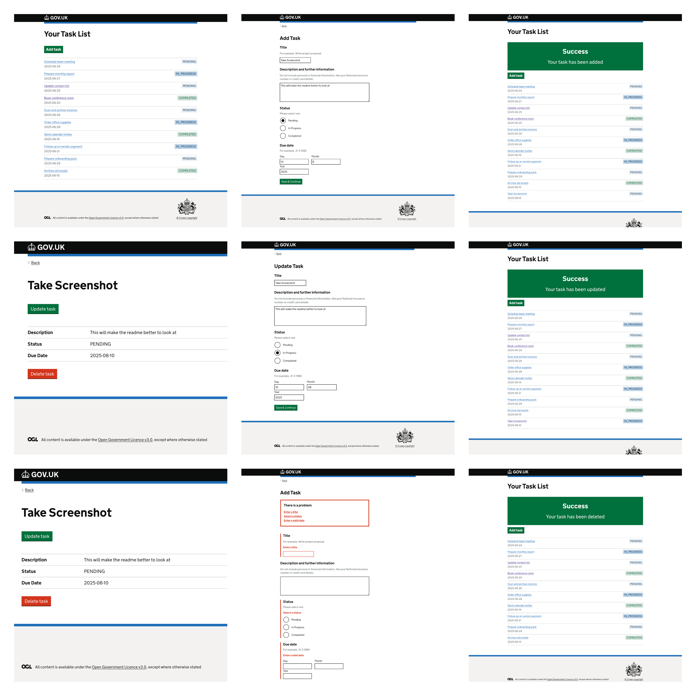

# Dev Test Frontend



## Prerequisites

- Node.js ≥ 18
- Yarn 3
- IDE with TypeScript support

---

## Build

```bash
yarn install
yarn webpack
```

---

## Run the Application

Development mode (with live reload):
```bash
yarn start:dev
```

Production mode:
```bash
yarn start
```

### Access
- App: [`localhost:3100`](https://localhost:3100)

---

## Run Tests

Unit tests:
```bash
yarn test:unit
```

Route/controller wiring tests:
```bash
yarn test:routes
```

Test coverage:
```bash
yarn test:coverage
```

---

## Further Reading

- [Express.js Docs](https://expressjs.com/)
- [GOV.UK Frontend](https://design-system.service.gov.uk/)
- [Jest Docs](https://jestjs.io/)
